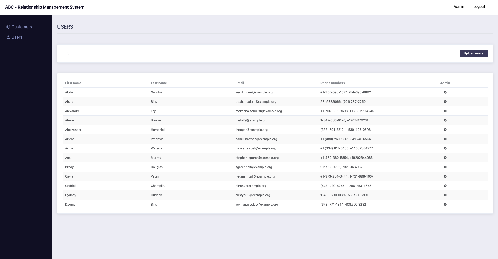
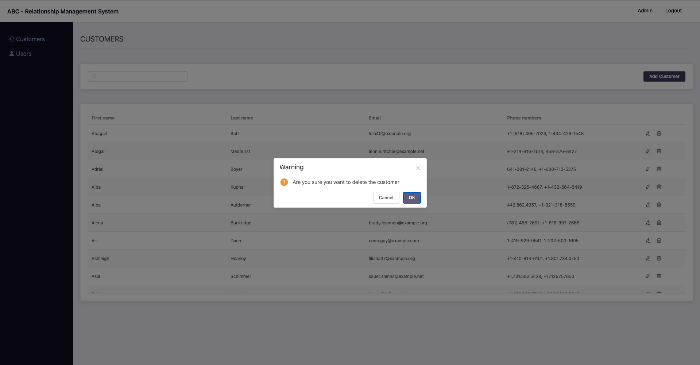

## About Abc RMS

Abc RMS is an admin panel to maintain customers and users. Features are as follows

- Customers - Create, update, delete and search customers
- Users - Create and update via CVS, search users
- Api endpoints - supports for all devices

### Utilized Packages and frameworks 

- Vue framework - frontend
    - Tailwindcss - styling the frontend
    - Element ui - for html element
    - Vuex - for state management
    - Vue router - for frontend routes
    - Vue infinite loading -  infinite loading in tables  
- Laravel framework - backend  
    - Laravel sanctum - for authentication 
    - Laravel swagger ui - for api documentation
    - League CVS - read csv

### How to set up ?

- Install [valet](https://laravel.com/docs/8.x/valet)
- Create two databases 
    - main - (abc)
    - testing - (abc_test)
    
- Run the following commands

```bash
# clone [abc-rms](https://github.com/aganlath/abc-rms) repository 
git clone git@github.com:aganlath/abc-rms.git

# Switch to the repo
cd abc-rms

#Secure the repo by running following command
valet secure

# install composer
composer install

#generate app key
php artisan key:generate.

#create env
cp .env.example .env

#replace following with appropriate values
APP_URL=http://localhost

DB_CONNECTION=mysql
DB_HOST=127.0.0.1
DB_PORT=3306
DB_DATABASE=abc
DB_USERNAME=root
DB_PASSWORD=

SANCTUM_STATEFUL_DOMAINS=127.0.0.1

# create testing env
cp .env.example .env.testing

#replace following with appropriate values
DB_CONNECTION=mysql
DB_HOST=127.0.0.1
DB_PORT=3306
DB_DATABASE=abc
DB_USERNAME=root
DB_PASSWORD=

# migrate and seed main database
php artisan migrate --seed

#migrate testing database
php artisan migrate --env=testing

#build frontend
npm install && npm run dev

#serve the application
php artisan serve
```

You can access the system via `http://127.0.0.1:8000/`

### Testing

- Run `php artisan test` for api testing

### System info

#### API documentation
```bash
http://127.0.0.1:8000/api/documentation
```

#### Login


- login using the following credentials
    ```bash
    #admin
    email: admin@abc.com
    password: secret
  
    #non admin - by default this will give a validation error since only admin is authorized access
    email: user@abc.com
    password: secret
    ```
  
#### Users Index


- to update or create users, run the following command.
- by default email will be considered row identifier when updating users via csv  
- provide id of user in the csv to update email address

```bash
php artisan admin:upload-users storage/csv/users.csv
```

#### Customers Index



